# Multimodal Building Damage Assessment

[](https://python.org)
[](https://pytorch.org)
[](https://streamlit.io)
[](https://huggingface.co/datasets/Kullervo/BRIGHT)

## Why This Project

After a disaster like an earthquake or hurricane, first responders need damage maps within hours — but optical satellite imagery is frequently blocked by clouds, smoke, or darkness. Synthetic Aperture Radar (SAR) penetrates all of these, making it available day and night in any weather.

This project builds a dual-modality deep learning system that fuses pre-event optical imagery with post-event SAR to classify building damage at the tile level. The core research question — framed as a rigorous ablation — is: **does adding SAR to optical actually improve damage classification, or is optical alone sufficient?**

The answer from Phase 1 (Turkey earthquake, 884 labelled tiles): SAR provides a measurable positive signal (+1.7 pp macro F1), but the Damaged class remains the blocker due to severe class imbalance in the val set. Phase 1.5 adds Beirut explosion data to address this directly.

## System Architecture

```mermaid
flowchart LR
    A[("HuggingFace\nBRIGHT Dataset\n9.9 GB pre-event.zip\n3.3 GB post-event.zip")] -->|"HTTP range requests\n(central directory only)"| B

    subgraph B ["Download Pipeline (scripts/download_events.py)"]
        B1["Zip64 EOCD\nParser"] --> B2["Central Directory\nCache (.cd_cache)"]
        B2 --> B3["Selective Tile\nDownloader"]
    end

    B3 -->|"~3.5 GB TIFs\n(Turkey only)"| C

    subgraph C ["Data Loading (src/data/brighT_loader.py)"]
        C1["_is_valid_tif()\ncorruption guard"] --> C2["_derive_tile_label()\narea-weighted thresholds"]
        C2 --> C3["BRIGHTDataset\n(optical 3ch + SAR 1ch)"]
    end

    C3 --> D

    subgraph D ["Training (scripts/train_model.py)"]
        D1["MultimodalDamageCNN\n(optical + SAR)"] --> D3["Ablation Gate\nΔF1 > 0.05"]
        D2["SingleModalDamageCNN\n(optical only)"] --> D3
    end

    D --> E["scripts/export_inference.py\n(parquet + base64 thumbnails)"]

    E -->|"data/inference_results.parquet\n(15 MB — committed to git)"| F

    subgraph F ["Dashboard (src/ui/dashboard.py)"]
        F1["Ablation Results\n(KPIs + confusion matrices)"]
        F2["Tile Gallery\n(paginated + filtered)"]
        F3["Tile Inspector\n(per-tile confidence)"]
    end
```



## Features

### Dashboard (3 tabs — no model or TIF files required at runtime)

| Tab | What it shows |
|-----|--------------|
| **Ablation Results** | KPI row (val tiles, multimodal macro F1, optical F1, SAR delta, accuracy); per-class F1 grouped bar chart; side-by-side confusion matrices (multimodal vs optical-only); true label distribution chart |
| **Tile Gallery** | Paginated 4-column grid (24 tiles/page) of optical + SAR thumbnail pairs; filterable by split, true label, model, and correct/misclassified only; per-tile true vs predicted label badge |
| **Tile Inspector** | Select any tile by ID; view optical and SAR thumbnails side by side; dual confidence bar chart comparing multimodal and optical-only predictions on the same tile |

### Download Pipeline

Selective HTTP range-request downloader — reads only the zip central directory from
HuggingFace, then fetches only the tiles needed for a given event. Never downloads the
full 9.9 GB pre-event.zip or 3.3 GB post-event.zip.

- Zip64 EOCD and central directory parsing with sequential field reading (per ZIP spec §4.5.3)
- CDN pre-signed URL refresh on HTTP 403 (HuggingFace URL expiry)
- Exponential-backoff retry (5 attempts: 1s → 2s → 4s → 8s → 16s) for transient drops
- Central directory cached to `data/.cd_cache/` — subsequent runs skip the EOCD read entirely
- Resume-safe: already-downloaded tiles are skipped

### Training Pipeline

- Dual ablation via `MODEL_TYPE` environment variable: `multimodal` (optical+SAR) or `optical_only`
- Multi-event support: pass multiple event names to train on a `ConcatDataset`
- Area-weighted tile label derivation from pixel-level masks (configurable thresholds)
- CrossEntropyLoss with class weights `[1.0, 5.0, 10.0]` (Intact / Damaged / Destroyed)
- Macro F1 with explicit `labels=list(range(3))` to avoid sklearn class-presence bias
- Best checkpoint saved by val macro F1 (not val loss)

## Model Performance — Turkey Earthquake (Phase 1)

| Metric | Multimodal (Optical + SAR) | Optical-only |
|--------|---------------------------|--------------|
| **Val Macro F1** | **0.4091** | 0.3924 |
| **Val Accuracy** | 0.61 | 0.58 |
| Intact F1 | 0.67 | 0.65 |
| Damaged F1 | 0.00 | 0.00 |
| Destroyed F1 | 0.56 | 0.53 |
| Parameters | 2,611,459 | 1,273,251 |
| SAR signal (ΔF1) | **+0.0167** | — |
| Train tiles | 772 | 772 |
| Val tiles | 112 | 112 |

> Phase 1 ablation gate: F1(multimodal) > F1(optical-only) + 0.05. Gate not yet passed (+0.017).
> Damaged class (6 val samples) drags macro F1 for both. Phase 1.5 will add Beirut explosion
> data (15–20% Damaged rate) to address the class imbalance.

## Key Takeaways — Phase 1 Lessons Learned

1. **The pipeline works end-to-end on Apple MPS.** Selective range-request download, custom CNN training, and Streamlit deployment all run without GPU. The hardware constraint was a design asset, not a limitation.

2. **The falsification gate correctly identified insufficient data.** The ablation gate (+0.05 F1) was not passed. The diagnosis was precise: the Damaged class had 6 val samples, making its F1 numerically undefined for both models. The gate worked as intended — it prevented over-interpretation of a noisy result.

3. **The Damaged class is the hardest to classify.** Intact and Destroyed have visually distinct signatures (stable vs. rubble). Damaged is the ambiguous middle ground — partially standing buildings with SAR shadow changes that are subtle at 512×512 tile resolution. Class imbalance compounds this.

4. **SAR provides a real but small signal improvement.** +1.7 pp macro F1 at epoch 5 is consistent and reproduced. Destroyed recall is 0.78 for both models — the backbone is learning structural collapse features. The SAR channel is not noise. The signal will be more visible with a stronger backbone (Phase 2) and more balanced data (Phase 1.5).

5. **Pre-computed parquet is the right deployment architecture.** The Streamlit dashboard loads from a 15 MB file with five pure-Python dependencies. No model weights, no rasterio, no GPU at runtime. This makes the demo instantly accessible to any reviewer.

## Roadmap

| Phase | Focus | Status |
|-------|-------|--------|
| **Phase 1** | Custom 4-layer CNN, Turkey earthquake. Validate SAR signal vs optical-only via ablation gate. | **Complete** |
| **Phase 1.5** | Add Beirut explosion data (15–20% Damaged rate). Address class imbalance; re-test ablation gate. | Planned |
| **Phase 2** | ResNet-18 pretrained optical branch + averaged first conv for SAR domain adaptation. Remove architecture as a confound. | Planned |
| **Phase 3** | Add UNet-style decoder to the Phase 2 encoder (reuse weights, no retraining). Pixel-level segmentation, mIoU evaluation. | Planned |
| **Phase 4** | DamageFormer / ChangeMamba. Match BRIGHT paper benchmark scores. | Exploratory |

## Architecture Decision Records

All major design decisions are documented before implementation. See [docs/adr/](docs/adr/README.md) for the full index.

| ADR | Decision | Status |
|-----|----------|--------|
| [ADR-001](docs/adr/ADR-001-task-framing.md) | Tile-level classification as stepping stone to pixel segmentation | Accepted |
| [ADR-002](docs/adr/ADR-002-tile-label-derivation.md) | Area-weighted label derivation with 1%/5% thresholds | Amended |
| [ADR-003](docs/adr/ADR-003-validation-strategy.md) | Macro F1 + relative improvement gate (+0.05) | Accepted |
| [ADR-004](docs/adr/ADR-004-backbone-and-sar-adaptation.md) | ResNet-18 backbone with averaged first conv for SAR (Phase 2) | Accepted |
| [ADR-005](docs/adr/ADR-005-encoder-architecture.md) | Spatial/global split; AdaptiveAvgPool2d as separable module | Accepted |
| [ADR-006](docs/adr/ADR-006-deployment-and-output.md) | GeoJSON/PNG/SMS output hierarchy for field deployment | Accepted |

## Project Structure

```
multimodal-damage-assessment/
├── .streamlit/
│   └── config.toml                    # Dark theme + coral accent
├── src/
│   ├── data/
│   │   └── brighT_loader.py           # BRIGHTDataset, _derive_tile_label, _is_valid_tif
│   ├── models/
│   │   └── baseline_model.py          # BranchCNN, MultimodalDamageCNN, SingleModalDamageCNN
│   └── ui/
│       └── dashboard.py               # Streamlit 3-tab dashboard (reads parquet only)
├── scripts/
│   ├── download_events.py             # Selective HuggingFace downloader (range requests)
│   ├── train_model.py                 # Multi-event training with ablation support
│   └── export_inference.py            # Pre-compute inference → parquet with thumbnails
├── docs/
│   ├── ARCHITECTURE.md                # Mermaid diagrams: Phase 1 model, Phase 3 extension,
│   │                                  #   operational pipeline, phase roadmap
│   ├── BRIGHT_SUMMARY.md              # Dataset summary and key statistics
│   └── adr/
│       ├── README.md                  # ADR index
│       ├── ADR-001-task-framing.md    # Tile classification as stepping stone to segmentation
│       ├── ADR-002-tile-label-derivation.md  # Area-weighted thresholds + Morocco amendment
│       ├── ADR-003-validation-strategy.md    # Macro F1 + relative improvement gate
│       ├── ADR-004-backbone-and-sar-adaptation.md  # ResNet-18, averaged first conv
│       ├── ADR-005-encoder-architecture.md   # Spatial/global split, separate pool module
│       └── ADR-006-deployment-and-output.md  # GeoJSON/PNG/SMS output hierarchy
├── data/
│   ├── .cd_cache/                     # Zip central directory caches (committed, ~500 KB)
│   └── inference_results.parquet      # Pre-computed predictions + thumbnails (committed)
├── outputs/                           # Model checkpoints (.pt — gitignored)
├── BRIGHT/                            # BRIGHT benchmark repo (gitignored — clone separately)
├── requirements-streamlit.txt         # Minimal deps for Streamlit Cloud deployment
└── pyproject.toml                     # Full Poetry dependency spec
```

## Setup

**Prerequisites:** Python 3.12, [Poetry](https://python-poetry.org/).

```bash
git clone https://github.com/sabrinapribadi/multimodal-damage-assessment.git
cd multimodal-damage-assessment
poetry install
```

## Data Setup

```bash
# Download Turkey earthquake tiles (~3.5 GB — only the Turkey slices, not the full zips)
python scripts/download_events.py turkey-earthquake

# Optional: add Beirut explosion data for Phase 1.5
python scripts/download_events.py turkey-earthquake beirut-explosion
```

The downloader reads the central directory from each HuggingFace zip via HTTP range requests
and fetches only the tiles belonging to the requested event. Central directory JSON caches
in `data/.cd_cache/` so subsequent runs skip the EOCD read and jump straight to missing tiles.

Event names available: `bata-explosion`, `beirut-explosion`, `congo-volcano`, `haiti-earthquake`,
`hawaii-wildfire`, `la`, `libya-flood`, `marshall-wildfire`, `mexico-hurricane`,
`morocco-earthquake`, `myanmar-hurricane`, `noto-earthquake`, `turkey-earthquake`, `ukraine-conflict`

## Training

```bash
# Multimodal (optical + SAR) — default
python scripts/train_model.py turkey-earthquake

# Optical-only ablation
MODEL_TYPE=optical_only python scripts/train_model.py turkey-earthquake

# Multi-event (Phase 1.5)
python scripts/train_model.py turkey-earthquake beirut-explosion
```

Training prints a per-epoch table with train loss/acc, val loss/acc, val macro F1, and
checkpoint saves. Best checkpoint is saved to `outputs/best_{events}_{model_type}.pt`.

## Exporting Inference & Running the Dashboard

```bash
# 1. Run once after training — generates the dashboard parquet (~10-15 MB)
python scripts/export_inference.py

# 2. Launch the dashboard (reads parquet only — no model weights or TIF files needed)
PYTHONPATH=. streamlit run src/ui/dashboard.py
```

Dashboard opens at `http://localhost:8501`.

### Streamlit Cloud Deployment

Commit `data/inference_results.parquet` and use `requirements-streamlit.txt` as the
requirements file. No GPU, no rasterio, no PyTorch needed on the cloud server.

```bash
git add data/inference_results.parquet
git commit -m "Add pre-computed inference parquet for Streamlit deployment"
```

## Tech Stack

| Layer | Library / Tool |
|-------|---------------|
| Deep Learning | PyTorch 2.x, torchvision |
| GeoTIFF I/O | rasterio |
| Data | NumPy, Pandas, pyarrow (parquet) |
| Frontend | Streamlit 1.35+, Plotly Graph Objects |
| Metrics | scikit-learn (F1, confusion matrix) |
| Download | httpx (async-capable), huggingface_hub |
| Image processing | Pillow |
| Language | Python 3.12 |
| Hardware | Apple MPS / CUDA / CPU (auto-detected) |

## Key Dataset Facts (BRIGHT — Turkey Earthquake Subset)

- **Total tiles:** 1,114
- **Train tiles (after label filtering):** 772
- **Val tiles (after label filtering):** 112
- **Val label distribution:** Intact 74 / Damaged 6 / Destroyed 32
- **Tile size:** 512×512 pixels (resized to 224×224 for training)
- **Pre-event:** Optical RGB GeoTIFF (3 channels)
- **Post-event:** SAR GeoTIFF (1 channel, intensity)
- **Target:** Pixel-level mask (0=background, 1=Intact, 2=Damaged, 3=Destroyed)
- **Tile label rule:** Destroyed if ≥1% building pixels destroyed; Damaged if ≥5%; Intact otherwise; skip if <200 building pixels

## Data Source

[BRIGHT Dataset — HuggingFace (Kullervo/BRIGHT)](https://huggingface.co/datasets/Kullervo/BRIGHT)

Chen et al. (2025). BRIGHT: a globally distributed multimodal building damage assessment
dataset with very-high-resolution for all-weather disaster response.
*Earth System Science Data*, 17(11), 6217–6253. https://doi.org/10.5194/essd-17-6217-2025
