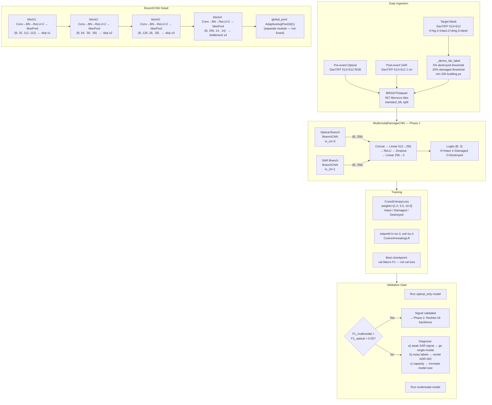
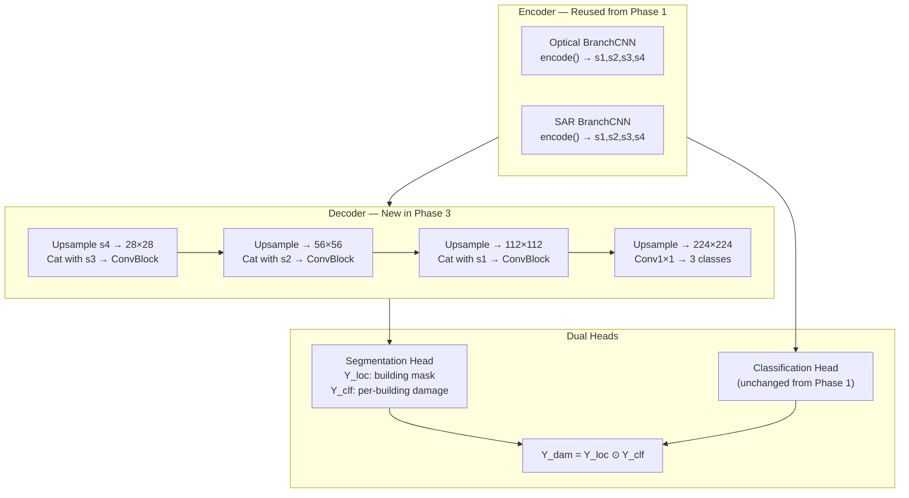

# System Architecture — Morocco Earthquake Damage Assessment

## Phase 1 Architecture (Current)



---

## Phase 3 Extension (Future — Surgical Addition)



---

## End-to-End Operational Pipeline (Phase 2+)

```
  [Capella/Umbra SAR overpass]           [Pre-event optical archive]
           │                                        │
           ▼                                        ▼
   GeoTIFFTiler                           GeoTIFFTiler
   ─ sliding window 512×512              ─ aligned to SAR extent
   ─ overlap=64 for edge continuity      ─ same tile grid
   ─ despeckle → dB → 3σ clip → norm     ─ percentile stretch → norm
   ─ preserve (minx,miny,maxx,maxy)      ─ preserve geobounds
           │                                        │
           └──────────────┬─────────────────────────┘
                          ▼
              MultimodalDamageCNN
              ─ batch_size=32 (MPS)
              ─ ~42 seconds for 567 tiles
              ─ outputs: class + confidence per tile
                          │
           ┌──────────────┼──────────────────┐
           ▼              ▼                  ▼
      GeoJSON          PNG map          SMS priority list
  (primary output)  (secondary)          (tertiary)
   QGIS / ArcGIS     WhatsApp         Field responders
   Google Earth       email           without internet
```

---

## Phase Roadmap

| Phase | Model | Data | What It Proves |
|-------|-------|------|----------------|
| **1 (current)** | Custom 4-layer CNN, random init | Morocco (567 tiles) | Pipeline works; multimodal > optical-only? |
| **1.5** | Custom CNN, random init | Full BRIGHT (14 events, ~4246 tiles) | Can the model generalize across events? |
| **2** | ResNet-18, pretrained optical / averaged-conv SAR | Full BRIGHT | Multimodal signal isolated from architecture confound |
| **3** | ResNet-18 + UNet decoder | Full BRIGHT | Pixel-level segmentation; comparable to paper mIoU |
| **4** | DamageFormer / ChangeMamba | Full BRIGHT | Match paper benchmark; production candidate |

---

## Key ADR Decisions in One View

| Decision | Choice | Alternative Rejected |
|----------|--------|---------------------|
| Task type | Tile classification (stepping stone) | Direct segmentation |
| Tile label | Area-weighted: Destroyed≥5%, Damaged≥20%, min 200px | max() — too noisy |
| Metric | Macro F1 + relative improvement gate | Accuracy — majority-class bias |
| SAR backbone | ResNet-18, averaged first conv | Repeat 1→3 — domain mismatch |
| Encoder design | Spatial/global split; AdaptiveAvgPool2d separate | Fused pool (one-way door) |
| LLM stack | Removed (Phase 4, after signal validated) | Keep as placeholder |
| Output format | GeoJSON primary, PNG secondary, SMS tertiary | Streamlit-only |
